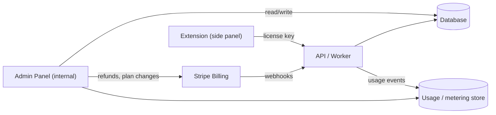

# NghienDeutsch — Admin Panel Plan

> Status: **planning document only — no implementation / no code.**
> Scope: a back-office web app for the team behind the NghienDeutsch shadowing extension to manage customers, sales, subscriptions, payments, usage/quotas, analytics, support and compliance.

This plan is research-backed, drawing on common patterns from consumer language apps (Duolingo, Babbel, Busuu, ELSA Speak) and standard B2C SaaS admin tooling (Stripe Billing, usage-based metering, GDPR data-subject workflows).

---

## 1. Context & current architecture (what the admin panel must wrap)

The extension today already contains the seeds of a paid product:

- **Auth**: email/password login screens (`view-auth`) backed by a Cloudflare Worker (`WORKER_URL`, endpoints like `/me`).
- **License / plan**: an account badge (`account-plan-badge`) showing **Free** vs **Pro**.
- **Usage meter** in the side panel: "Dịch hôm nay" (translations today, e.g. `0 / 20`) and "AI hôm nay" (AI calls today, e.g. `0 / 10`) — i.e. **daily quotas already exist client-side**.
- **Upgrade CTA**: "Nâng cấp Pro" button.
- **Server-side secrets**: DeepL / OpenRouter / Groq keys live on the Worker so the client only sends a license key. Translation falls back DeepL → Google → Microsoft → MyMemory; STT uses Groq (server) or local Whisper.
- **Local vs server work**: scoring/Whisper can run **locally in the browser** (free, no server cost) or **on the server** (Groq, costs money). This split is central to metering.

**Implication for the admin panel:** the source of truth for billing and quotas is the **Worker + its datastore**, not the extension. The admin panel is a separate web app that reads/writes the same datastore and talks to Stripe.

---

## 2. Goals & non-goals

**Goals**
- Single internal console to see **who the customers are**, **what they pay**, **how much they use**, and **whether the business is healthy**.
- Manage the subscription lifecycle (Free ↔ Pro, trials, cancellations, refunds) without touching code.
- Meter and cap expensive operations (server STT, AI translation) per user/plan.
- Provide support staff the tools to help users (lookup, reset, impersonate, ban).
- Stay GDPR-compliant (export & delete on request, consent, audit trail).

**Non-goals (for v1)**
- Self-serve B2B/team seats, SSO/SAML, multi-currency tax automation beyond Stripe Tax.
- A public marketing CMS (kept separate).
- ML/experimentation platform (analytics is descriptive, not a full A/B engine).

---

## 3. Roles & access control (RBAC)

| Role | Can see | Can do |
| --- | --- | --- |
| **Owner** | Everything incl. revenue, secrets config | Manage admins, billing config, dangerous actions |
| **Admin** | Customers, subscriptions, payments, analytics | Refunds, plan changes, bans, comp/grant Pro |
| **Support** | Customer profile, usage, limited PII | Reset password link, resend email, adjust quota, open/close tickets |
| **Finance** | Payments, invoices, revenue dashboards | Issue refunds, export accounting reports |
| **Analyst (read-only)** | Aggregated analytics, cohorts | Export CSV, no PII edits |

Principles: least privilege; every privileged action is written to an **audit log** (who/what/when/before→after); 2FA required for Admin/Owner/Finance; **impersonation** is time-boxed, banner-flagged, and audited.

---

## 4. Customer & sales management (CRM-lite)

**Customer list** — searchable/filterable table: email, name, country, plan, status (trial/active/past_due/canceled), MRR contribution, signup date, last active, lifetime spend, learning target language (de/en), native language.

**Customer detail (360° view)**
- **Profile**: email, locale, target/native language, install date, devices/last seen, marketing consent state.
- **Subscription**: current plan, billing interval, renewal date, trial end, Stripe customer/subscription IDs (deep-link to Stripe).
- **Payments**: invoices, payment methods (last4 only), failed payments, refunds.
- **Usage**: today/30-day charts for translations, AI calls, server STT minutes, local-vs-server ratio (see §7).
- **Learning activity**: sentences practiced, avg pronunciation score, streak/XP, saved words, weak words count, flashcards reviewed. (Read from app data; useful for churn/health and support.)
- **Support**: notes, ticket history, flags (abuse, chargeback risk).
- **Actions**: grant/revoke Pro (comp), extend trial, adjust daily quota, send password reset, export data, delete account, ban/unban.

**Sales/pipeline lite**: track upgrade funnel events (saw paywall → started checkout → paid), high-usage Free users likely to convert ("upgrade candidates" segment), win-back list for churned Pro users.

---

## 5. Subscription tiers (Free / Pro) & plan management

### Suggested plan matrix

| Capability | Free | Pro |
| --- | --- | --- |
| Dual subtitles on video | ✅ | ✅ |
| Sentence navigation, loop, listen | ✅ | ✅ |
| **Local** pronunciation scoring (browser Whisper / Web Speech) | ✅ | ✅ |
| Word lookup translation | ✅ (daily cap, e.g. 20/day) | ✅ Unlimited (fair-use) |
| **Server** AI scoring / AI translation (Groq, premium models) | Limited (e.g. 10/day) | ✅ Higher cap / priority |
| Saved vocabulary & flashcards | ✅ (cap, e.g. 50 words) | ✅ Unlimited |
| Offline/priority STT model | base only | up to medium |
| Support | community | priority |

(Numbers are placeholders to be tuned against real API cost; the panel must let admins edit caps without a deploy — see "feature flags / plan config".)

### Upgrade / downgrade lifecycle
- **Upgrade**: Stripe Checkout → on `checkout.session.completed`/`customer.subscription.updated`, set plan=Pro, lift caps immediately (proration handled by Stripe).
- **Downgrade / cancel**: cancel at period end (keep Pro until paid period ends), then revert to Free caps; show win-back offer.
- **Trial**: optional N-day Pro trial; auto-convert unless canceled; dunning emails before charge.
- **Grace / dunning**: `past_due` → retain access for a grace window while Stripe retries; suspend Pro features if final failure.
- **Comp / manual grants**: admins can grant Pro (e.g. influencers, refunds-in-kind) with an expiry and a reason (audited).

### Plan config (no-deploy)
A **plans/limits config** (editable in-panel) defines each plan's quotas, model access, and feature flags. The extension reads effective limits from `/me`; the admin panel writes them. This is how "20/day", "10/day", model tiers, etc. are changed safely.

---

## 6. Payment management (Stripe)

Use **Stripe Billing** as the system of record for money; the app DB stores only references (customer/subscription/price IDs) + cached status.

**Capabilities in the panel**
- View invoices, payment status, upcoming invoice, payment method (last4/brand only — never raw card data; PCI stays with Stripe).
- **Refunds** (full/partial) with reason codes; one-click from invoice; audited; Finance/Admin only.
- Retry failed payment / update card via Stripe-hosted **Customer Portal** link (don't build card forms).
- Coupons / promo codes, free-trial toggles, regional pricing (Stripe Tax for VAT).
- **Chargeback/dispute** view and risk flags.

**Webhooks to consume** (server side; panel reflects results):
`checkout.session.completed`, `customer.subscription.created|updated|deleted`, `invoice.paid`, `invoice.payment_failed`, `charge.refunded`, `customer.updated`, dispute events. Webhooks must be **idempotent** and **signature-verified**; provide a webhook event log + replay tool in the panel for debugging.

**Reconciliation**: nightly job compares Stripe state vs app DB and surfaces mismatches (e.g. Pro in DB but canceled in Stripe).

---

## 7. Usage metering (the core cost-control feature)

Every chargeable/limited action emits a **usage event** to a metering store. Minimum event shape (described, not coded): user id, timestamp, event type, provider, model, run location, units, success/failure, latency, estimated cost.

**What to meter**
- **Translation**: segment + word lookups. Dimensions: provider (DeepL/Google/Microsoft/MyMemory), characters, cache hit/miss. (Most are free providers, but track for fair-use + cost if DeepL Pro key is used.)
- **STT / scoring**: dimension **run location = `local` vs `server`**. Local (browser Whisper / Web Speech) is **free** to the business; server (Groq) **costs money** → this is the primary metered, capped resource.
- **AI calls**: which **model** (OpenRouter/Groq model id), tokens in/out, estimated cost per call.
- **Per-user counters**: rolling daily/monthly counts that back the side-panel meters ("Dịch hôm nay", "AI hôm nay") and enforce caps via `/me`.

**Admin views**
- Per-user: today vs limit, 30-day trend, local-vs-server ratio (a healthy Free user is mostly local), top models used, estimated cost to serve this user (→ margin per user).
- Global: total server STT minutes/day, AI spend/day by model & provider, cost vs revenue, "most expensive users", abuse/anomaly detection (sudden spikes, scripted usage).
- **Quota controls**: edit a user's cap, reset their daily counter, temporarily throttle, or block server features while leaving local features on.

**Enforcement model**: caps enforced server-side at the API/Worker (authoritative); client meters are a UX mirror. Soft cap → upsell prompt; hard cap → 429 + friendly upgrade message. Cache translations aggressively to cut cost (already partially done client-side).

---

## 8. Analytics & dashboards

**Business / revenue**
- MRR, ARR, ARPU, new vs churned MRR, expansion (Free→Pro), refunds.
- Conversion funnel: install → signup → activation (first scored sentence) → paywall view → checkout → paid.
- Churn rate, trial conversion rate, LTV, CAC payback (if marketing spend is fed in).

**Engagement / product**
- DAU/WAU/MAU and stickiness (DAU/MAU).
- Retention cohorts (D1/D7/D30) by signup week and by target language.
- Activation metrics: % who practice ≥1 sentence, ≥1 mic score, save ≥1 word.
- Feature adoption: dual subs, loop, flashcards, vocabulary view, word popup.

**Learning outcomes (differentiator vs generic SaaS)**
- Avg pronunciation score over time, improvement curve, CEFR-style progress estimate, weak-phoneme heatmap (German Kölner clusters), streak distributions.

**Cost / ops**
- API spend by provider/model, server STT minutes, error rates (translate-all-failed, empty-transcript, mic-blocked), p50/p95 latency.

**Implementation notes**: descriptive dashboards backed by aggregated tables / a warehouse; date-range + segment filters (plan, language, country); CSV export; scheduled email digests for the team. Keep analytics PII-minimal (use ids, aggregate).

---

## 9. User management & support tooling

- **Lookup** by email/id/Stripe id.
- **Password reset link** (send Stripe/own email; never view passwords).
- **Quota override / reset counter** for support resolution.
- **Impersonate** (read-only or full, time-boxed, audited, banner shown to admin).
- **Ban / suspend** (abuse, chargeback, ToS) with reason; unban; soft-ban (disable server features only).
- **Bulk actions / segments**: e.g. grant 7-day Pro to a cohort, email an upgrade segment.
- **Notes & flags** on a profile; ticket integration (or lightweight built-in tickets).
- **Audit log** browser: filter by actor, target, action, date.

---

## 10. Data, privacy & compliance (GDPR/CCPA)

- **Lawful basis & consent**: record marketing-consent state and timestamp; honor opt-out.
- **Data Subject Access Request (DSAR) — Export**: one-click export of a user's personal data (profile, subscription, payments refs, usage, saved words/history) in a portable format; SLA tracked in panel.
- **Right to erasure (delete)**: hard-delete or anonymize personal data while retaining legally-required financial records (invoices) in pseudonymized form; cascade to Stripe (delete customer) and app DB; produce a deletion certificate/audit entry.
- **Data minimization & retention**: define retention windows (e.g. raw usage events 12–24 months, then aggregate-only); auto-purge.
- **PII handling in panel**: mask by default (email partially, card last4 only); access to full PII is role-gated and logged.
- **Records of processing & sub-processors**: list providers (Stripe, Groq, DeepL, Google, Microsoft translate, hosting, email) in an internal page; surface in privacy policy.
- **Security**: 2FA for staff, SSO for the admin app, encrypted secrets, no provider API keys ever exposed to clients (already the case), rate-limits, and an admin-action audit trail.
- **Breach readiness**: audit log + export tooling support 72-hour notification duties.

---

## 11. Suggested tech stack

| Layer | Recommendation | Why |
| --- | --- | --- |
| Admin web app | **Next.js (App Router) + TypeScript** | SSR/RSC, mature, hireable, integrates with Stripe/Auth easily |
| UI | **Tailwind CSS + shadcn/ui** + TanStack Table + Recharts/Tremor | Fast to build clean dashboards/tables/charts |
| Auth (staff) | **Auth.js / Clerk / WorkOS** with SSO + 2FA + RBAC | Secure internal access, roles |
| API/back end | Reuse the existing **Cloudflare Worker** (+ Workers KV/Durable Objects/Queues) or a Node service | Already holds secrets & license logic; keep one source of truth |
| Primary DB | **Postgres** (Neon/Supabase/RDS) | Relational customer/subscription data, transactions |
| Metering store | Postgres table + rollups, or a time-series/warehouse (**ClickHouse / BigQuery**) for high-volume events | Cheap aggregation for usage analytics |
| Billing | **Stripe Billing + Checkout + Customer Portal + Stripe Tax** | PCI offload, dunning, invoices, refunds out of the box |
| Analytics | Product analytics (**PostHog**) + warehouse dashboards; optional Metabase | Funnels, retention, cohorts without building from scratch |
| Email | Transactional (**Resend/Postmark**) | Resets, dunning, lifecycle |
| Error/uptime | **Sentry** + uptime monitor | Ops health |
| Hosting | **Vercel** (admin app) + Cloudflare (API) | Matches stack |
| Infra/secrets | Managed secrets (CF/Vercel env, Doppler) | Keep keys server-only |

**Build order (phased)**
1. **Phase 1 (foundations)**: staff auth + RBAC, customer list/detail (read-only), Stripe customer/subscription sync, audit log.
2. **Phase 2 (billing ops)**: refunds, plan grants/comp, trial/cancel handling, webhook log + replay, plan/limits config.
3. **Phase 3 (metering)**: usage events pipeline, per-user/global usage dashboards, quota overrides, cost-vs-revenue.
4. **Phase 4 (analytics & growth)**: funnels, retention cohorts, learning-outcome dashboards, upgrade-candidate segments, email campaigns.
5. **Phase 5 (compliance)**: DSAR export/delete workflows, consent/retention automation, sub-processor registry.

---

## 12. Open questions to confirm before building
- Final Free vs Pro caps and Pro price points (per-region?), monthly vs annual.
- Is server STT (Groq) the main cost driver, and should Free be **local-only** for scoring?
- Trial length (if any) and refund policy.
- Where does the source-of-truth user DB live today (Worker KV vs external DB)? Migration needed?
- Required compliance scope (EU only, or also CCPA/US, and any data-residency needs?).
