# NghienDeutsch — Kiến trúc hệ thống (v2)

Bộ 11 sơ đồ kiến trúc toàn diện. Xem phiên bản tương tác:
**[Interactive artifact](https://claude.ai/code/artifact/44739603-70f0-4063-8cae-053590067558)**

---

## D1 — Kiến trúc hệ thống (System Architecture)

C4 Level 2 · 4 lớp từ client đến data.

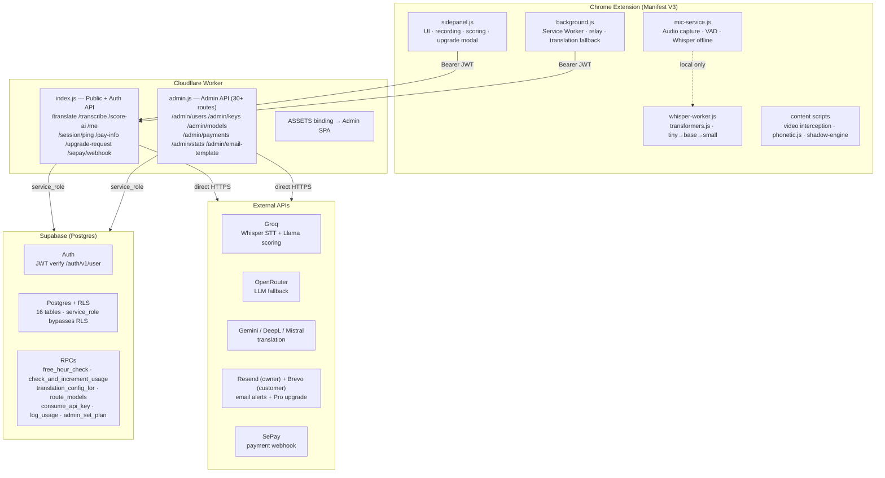

---

## D2 — Luồng Dịch thuật (Translation Flow)

Free users dùng browser-side API · Paid users dùng pool key từ Supabase.

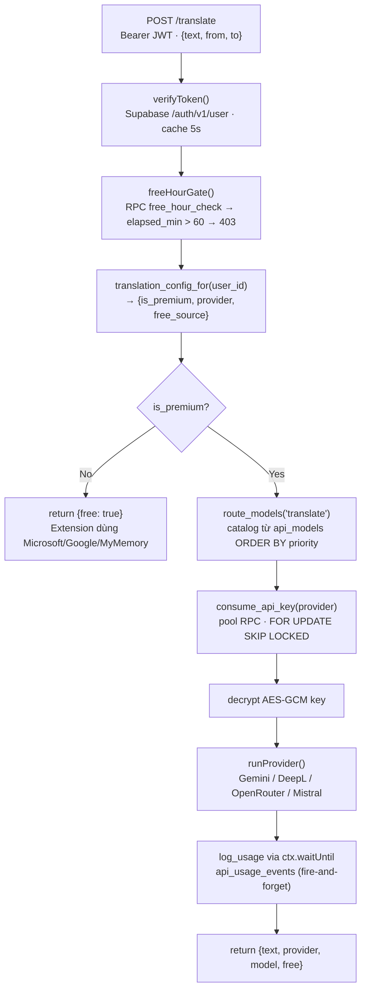

---

## D3 — Luồng Ghi âm & STT

Hai đường: local Whisper (offline) hoặc server Groq (online).

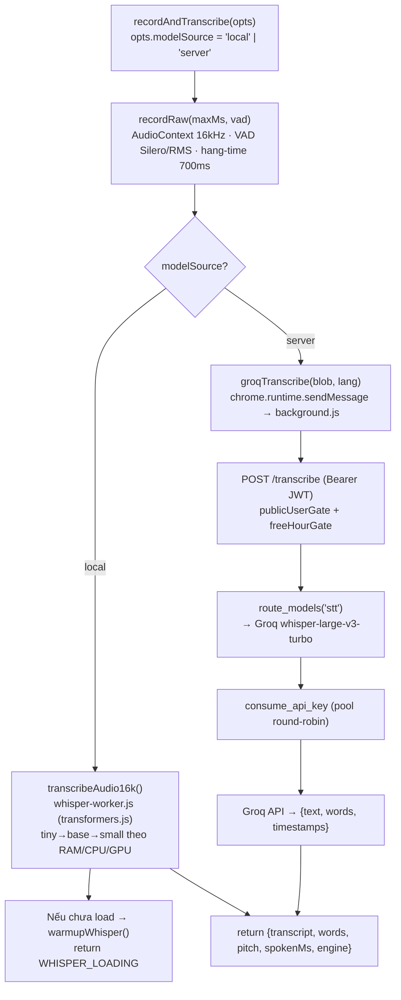

---

## D4 — Luồng Chấm điểm phát âm

Local phonetic luôn chạy · AI scoring chỉ khi modelSource = 'server'.

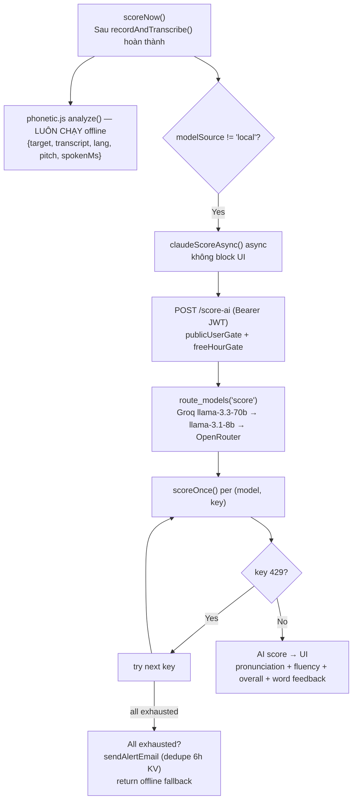

---

## D5 — Luồng Nâng cấp Pro (Payment/Upgrade)

Extension modal 3 bước → Worker tạo đơn → Email hai đầu → Webhook hoàn tất.

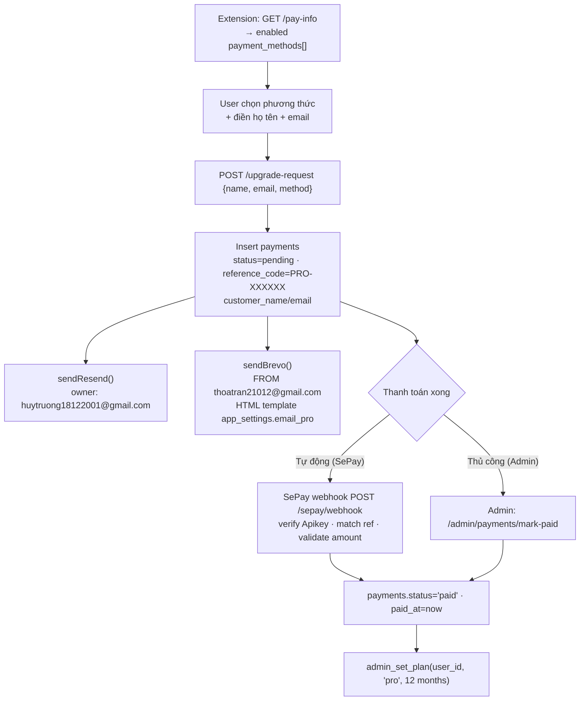

---

## D6 — Sơ đồ Cơ sở dữ liệu (ERD)

16 bảng · migrations 001→007 · RLS bật toàn bộ · chỉ service_role bypass.

```mermaid
erDiagram
  auth_users {
    uuid id PK
    text email
    timestamptz email_confirmed_at
  }
  profiles {
    uuid id PK_FK
    text plan
    text model_source
    bool banned
    text translation_provider
    text last_ip
    text prev_ip
    jsonb last_device
    uuid dedicated_api_key_id FK
  }
  subscriptions {
    uuid user_id FK
    text plan
    text status
    timestamptz current_period_end
  }
  usage {
    uuid user_id FK
    date date
    int translation_count
    int ai_count
    timestamptz first_used_at
    bigint tokens_in
    bigint tokens_out
  }
  login_events {
    bigint id PK
    uuid user_id FK
    timestamptz ts
    text event
    text ip
    text country
    text city
    text isp
    text device
    text os
    text browser
  }
  api_providers {
    text id PK
    text display_name
    bool enabled
    text kind
  }
  api_keys {
    uuid id PK
    text provider_id FK
    text secret_ref
    text status
    bigint credit_requests_used
    int priority
  }
  api_models {
    uuid id PK
    text provider_id FK
    text model_id
    text capability
    int priority
    bool enabled
  }
  api_usage_events {
    bigint id PK
    uuid key_id FK
    uuid user_id
    text provider_id
    text model
    bigint tokens_in
    bigint tokens_out
    numeric est_cost
  }
  admin_users {
    uuid id PK
    text email
    text password_hash
    bool totp_enabled
    int failed_attempts
  }
  admin_sessions {
    uuid id PK
    uuid admin_id FK
    timestamptz expires_at
    bool revoked
  }
  audit_log {
    bigint id PK
    uuid admin_id FK
    text action
    text target_type
    jsonb before
    jsonb after
  }
  payments {
    uuid id PK
    text reference_code
    uuid user_id
    text method
    text status
    text customer_name
    text customer_email
  }
  payout_config {
    int id PK
    text iban
    text paypal_link
    jsonb price_table
    jsonb payment_methods
    text qr_image
  }
  app_settings {
    text key PK
    jsonb value
  }
  plans {
    text name PK
    int daily_translations
    int daily_ai_calls
    decimal price_usd
  }

  auth_users ||--|| profiles : "1:1 cascade"
  auth_users ||--o{ subscriptions : "1:N cascade"
  auth_users ||--o{ usage : "1:N UNIQUE(user_id,date)"
  auth_users ||--o{ login_events : "1:N"
  profiles }o--o| api_keys : "dedicated_api_key_id"
  api_providers ||--o{ api_keys : "1:N cascade"
  api_providers ||--o{ api_models : "1:N cascade"
  api_keys ||--o{ api_usage_events : "1:N"
  admin_users ||--o{ admin_sessions : "1:N cascade"
  admin_users ||--o{ audit_log : "M"
```

---

## D7 — Xác thực (Authentication — 2 hệ thống)

### Hệ thống A — Extension Users (Supabase Auth)

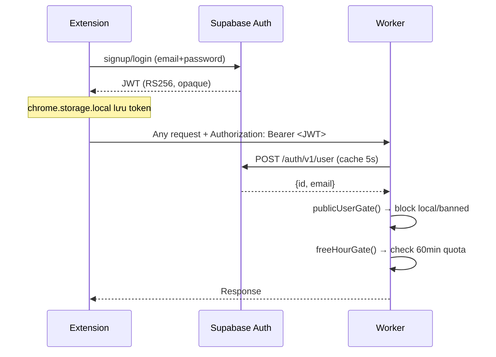

### Hệ thống B — Admin (PBKDF2 + HS256 + TOTP)

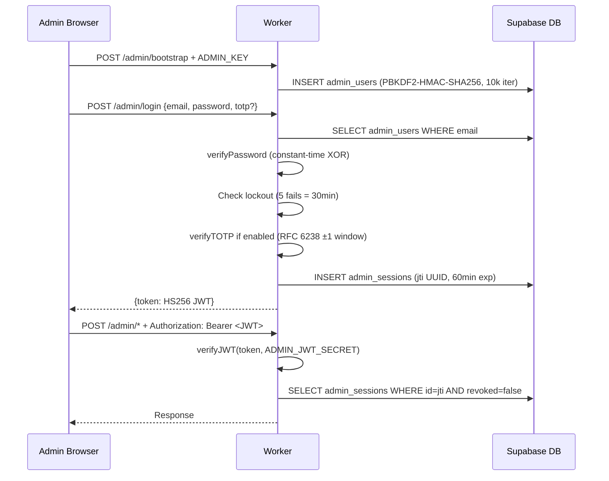

### API Key Encryption (AES-256-GCM)

```
Admin adds key:
  encryptSecret(env, plain)
  → SHA-256(KEY_ENCRYPTION_KEY) → AES-256-GCM key
  → 12-byte random IV + encrypt
  → store "aesgcm:<base64_iv>:<base64_ct>" in api_keys.secret_ref

Worker uses key:
  decryptSecret(env, stored) → plaintext (in memory only, never persisted)
```

---

## D8 — AI Gateway & Model Routing

Pool key rotation · provider fallback chain · async usage logging.

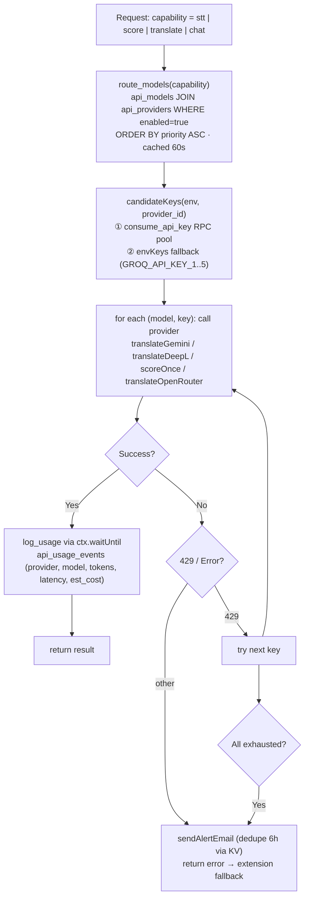

**Model catalog (api_models):**

| Provider | Model | Capability | Priority |
|----------|-------|-----------|---------|
| groq | whisper-large-v3-turbo | stt | 100 |
| groq | llama-3.3-70b | score | 100 |
| groq | llama-3.1-8b | score | 110 |
| openrouter | gpt-oss-120b | score | 200 |
| gemini | gemini-2.0-flash | translate | 100 |
| mistral | mistral-small-latest | translate | 100 |
| openrouter | gpt-oss | translate | 100 |
| deepl | deepl | translate | 100 |

---

## D9 — Hệ thống Hạn mức (Free/Pro Quota)

Free: 60 phút/ngày từ lần dùng đầu · Pro: không giới hạn giờ.

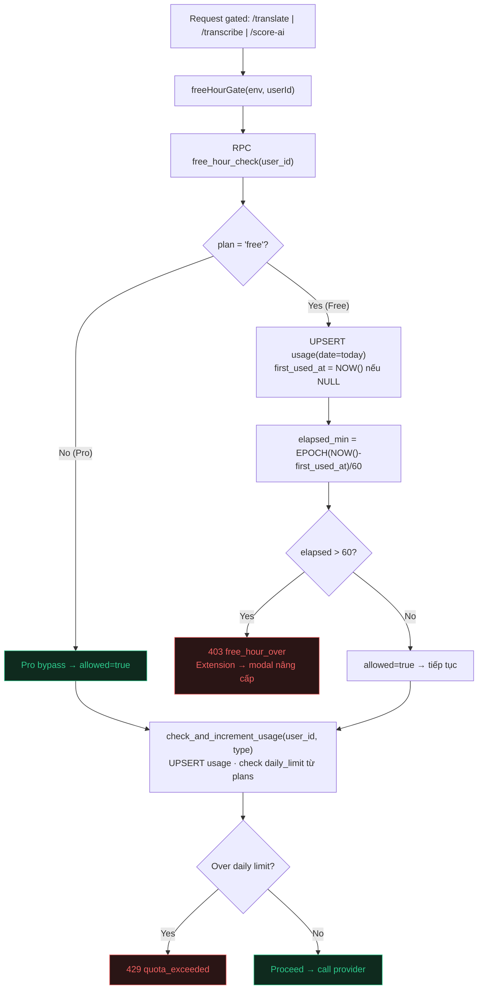

**Reset:** Tự nhiên theo ngày — `usage.date = CURRENT_DATE`; sang ngày mới = hàng mới, `first_used_at` NULL lại.

> ⚠ **Fail-open design:** Nếu RPC lỗi → `freeHourGate` trả null → allow. UX > security — cần document và monitor.

---

## D10 — Admin Panel (Page Map)

```mermaid
graph TD
  ROOT["Worker GET /*\nenv.ASSETS.fetch → admin/index.html"]

  ROOT --> DASH["#dashboard\nstats/overview + audit/list\n(user count · plan dist · revenue · key health)"]
  ROOT --> SYS["#system\nhealth + providers/list\nmodels/* + keys/* + settings/translation\nusage/summary (1-365 days)"]
  ROOT --> USERS["#users\nusers/list + users/detail\nban/unban/delete/set-plan\nmodel-source + translation override\n360° detail: device · network · login_events · anomaly"]
  ROOT --> PAY["#payments\npayout-config/get|update\npayments/list + create-order + mark-paid\n(IBAN · VN_QR · PayPal · giá EUR/VND)"]
  ROOT --> REV["#revenue\nrevenue/list\n(đơn paid · customer_name/email · Verwendungszweck · tổng)"]
  ROOT --> EMAIL["#emails\nemail-template/get|set\n(sửa subject/HTML · preview iframe\nplaceholders: {{name}} {{ref}} {{amount}})"]

  style ROOT fill:#1A2238,stroke:#5580FF
  style DASH fill:#131929,stroke:#5580FF
  style SYS fill:#131929,stroke:#F0A429
  style USERS fill:#131929,stroke:#26C9AD
  style PAY fill:#131929,stroke:#9670EF
  style REV fill:#131929,stroke:#2DC98C
  style EMAIL fill:#131929,stroke:#E879A0
```

**Auth pattern:** `api(path, body)` → POST `/admin/{path}` + Bearer token → auto-401 → re-render login.
Mọi write action → `audit(env, adminId, action, target, before, after, ip)` → `audit_log`.

---

## D11 — Logging & Analytics

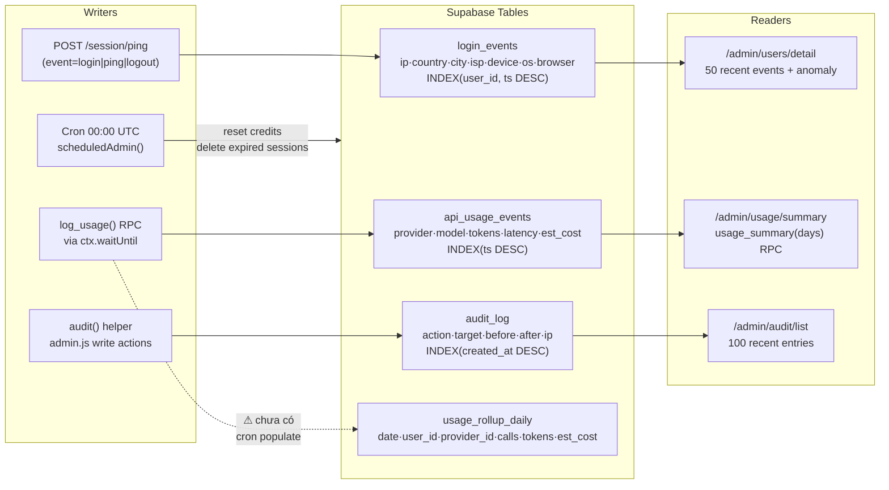

---

## Điểm cải thiện đề xuất

| # | Mức độ | Vấn đề | Đề xuất |
|---|--------|--------|---------|
| 1 | 🔴 Critical | API keys đã lộ trong chat (GitHub PAT, CF tokens, Supabase key, Brevo key, Groq keys) | Rotate ngay trên dashboard tương ứng |
| 2 | 🟡 Medium | `verifyToken()` cache module-level Map không đồng bộ khi scale nhiều Worker instances | Dùng Cloudflare KV với TTL 30s |
| 3 | 🟡 Medium | `free_hour_check` fail-open khi DB lỗi → allow mà không log | Thêm monitoring alert khi DB lỗi liên tục |
| 4 | 🟡 Medium | SePay webhook chỉ verify `Apikey` header, không có HMAC | Thêm HMAC-SHA256 signature nếu SePay hỗ trợ |
| 5 | 🟡 Medium | `usage_rollup_daily` không có job populate | Thêm vào `scheduledAdmin()` hàng ngày |
| 6 | 🔵 Low | Admin TOTP UI chưa đầy đủ trong SPA | Thêm TOTP enrollment vào #system hoặc #security page |
| 7 | 🔵 Low | `subscriptions` table ít được dùng, gây confusion | Simplify: merge `plan_expires_at` vào `profiles` |
| 8 | 🔵 Low | Brevo lỗi 400 (sender chưa verify) không được log rõ | Log lỗi Brevo + hiển thị trong admin health |

---

## D12. API Rate Limits & Capacity Planning

### Giới hạn từng provider (per API key)

| Provider | Capability | RPM | RPD | Token/Tháng | Ghi chú |
|----------|-----------|-----|-----|-------------|---------|
| **Groq** Whisper turbo | STT | 20 | 2,000 | — | 7,200 audio-sec/ngày/key |
| **Groq** Llama-3.3-70B | Score | 30 | 14,400 | 500K TPD | — |
| **Groq** Llama-3.1-8B | Score fallback | 30 | 14,400 | 500K TPD | — |
| **Gemini** 2.0 Flash (free) | Translate | 15 | 1,500 | 1.5B/ngày | 1M TPM |
| **DeepL** Free | Translate | không giới hạn | — | 500K chars/tháng | ~5K câu/ngày |
| **Mistral** Free | Translate | ~1 | — | 500K tokens/tháng | Bottleneck nặng |
| **OpenRouter** | Score/Translate | credits | credits | pay-as-go | Tùy số dư |
| **Resend** Free | Email owner | — | 100 | 3,000/tháng | Cho email quản trị |
| **Brevo** Free | Email khách | — | 300 | không giới hạn | Cho email Pro upgrade |

### Tổng hợp với 5 Groq keys

| Capability | RPM tổng | RPD tổng | Audio-sec/ngày |
|-----------|---------|---------|---------------|
| STT (Whisper) | **100 RPM** | **10,000 RPD** | ~10 giờ |
| Score (Llama 70B) | **150 RPM** | **72,000 RPD** | — |
| Score fallback (8B) | **150 RPM** | **72,000 RPD** | — |

### Mô hình sử dụng điển hình (1 session/ngày, 60 phút)

| Tier | STT calls | Score calls | Translate calls |
|------|-----------|-------------|----------------|
| Free (60 min/ngày) | ~80–120 | ~80–120 | ~30–50 |
| Pro (không giới hạn giờ) | ~200–400 | ~200–400 | ~100–200 |

### Capacity tối đa hiện tại

| Metric | Giá trị | Bottleneck |
|--------|---------|-----------|
| **Free DAU** (daily active users) | ~**100 users/ngày** | Groq STT: 10,000 RPD / 100 calls = 100 |
| **Free concurrent** (đồng thời) | ~**30 users** | 100 RPM / ~3 req/user/phút = 33 |
| **Pro DAU** | ~**30–50 users/ngày** | Gemini: 1,500 RPD / 50 calls = 30 |
| **Pro concurrent** | ~**10–15 users** | — |
| **Email upgrade (Resend)** | **100 emails/ngày** | Resend free tier |

### Bottleneck & Scale plan

| Mục tiêu | Giải pháp | Chi phí |
|---------|----------|---------|
| 500 free users/ngày | Thêm 20 Groq keys (5 accounts mới) | Free |
| 200 pro users/ngày | Upgrade Gemini pay-as-go | ~$5–10/tháng |
| 1,000+ users | Groq paid: $0.04/audio-min Whisper | ~$50–100/100 users/tháng |
| Giảm STT calls | Cache transcript kết quả (KV by hash) | Free (Cloudflare KV 100K/day) |
| Giảm translate calls | Cache dịch câu giống nhau | Free (Cloudflare KV) |

### Worker rate limit (Cloudflare native)

- `/translate` và `/ai-translate`: **30 requests / 60 giây** per user (Cloudflare GA rate limiting)
- Không áp dụng cho `/transcribe` và `/score-ai` (giới hạn bởi Groq quota)

---

## Ghi chú kỹ thuật

- **RLS**: Tất cả bảng bật RLS. `profiles/usage/subscriptions/plans` có policy cho `authenticated` role. Admin/API/Payment tables chỉ `service_role` (Worker) truy cập.
- **model_source routing**: `local` → extension chỉ dùng Whisper offline, Worker trả 403 `use_local` nếu lỡ gọi. `server` → Groq pool. `dedicated` → key riêng của user (`profiles.dedicated_api_key_id`).
- **Key pool**: `consume_api_key` dùng `FOR UPDATE SKIP LOCKED` để atomic và tránh race condition khi nhiều Worker instances cùng chọn key.
- **Email template**: Lưu trong `app_settings.email_pro = {subject, html}`. Admin sửa qua `/admin/email-template/set`. Default template = HTML tiếng Đức DW-style, seeded khi deploy.
- **Migrations**: 001 (core) → 002 (admin+API) → 003 (translation) → 004 (api_models+routing) → 006 (plans free/pro+QR) → 007 (login_events, first_used_at, payment_methods, customer_*, email_pro) → **008 (giá 3.99€, RPC `rollup_usage_daily`, bảng `user_data` đồng bộ từ vựng)**.

## Cập nhật mới nhất (2026-06)

- **Tiền tệ**: Giá Pro chuẩn = **3.99 €** (đơn vị euro, không còn cent). VND **quy đổi LIVE** trong Worker (`eurToVnd` qua Frankfurter/ECB → open.er-api → hằng số dự phòng, cache 6h). IBAN→EUR, QR VN→VND.
- **Mã đơn**: `genRef()` → **`DE-#####`** (5 số) — khớp regex webhook SePay, tự cập nhật Doanh thu.
- **Email**: thêm placeholder `{{plan}}`; `/upgrade-request` tự điền name + plan, gửi Brevo.
- **Đồng bộ tài khoản**: endpoint **`POST /sync`** (pull/push) + bảng `user_data` → từ vựng/câu/yêu thích theo tài khoản trên mọi thiết bị. Background SW pull-merge khi đăng nhập, push (debounce) khi đổi.
- **Khắc phục audit**: verifyToken cache 30s; log fail-open `free_hour_check`; cron điền `usage_rollup_daily`; Brevo log status+body. Chi tiết & khuyến nghị: xem [`REVIEW.md`](./REVIEW.md).
