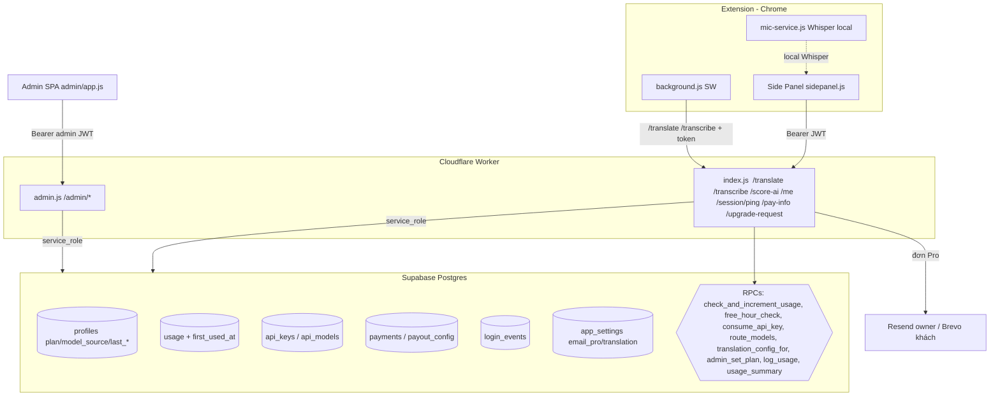

# NghienDeutsch — Sơ đồ tổng quan hệ thống (database + code)

Tài liệu mô tả các thành phần và luồng hoạt động: **Extension (Chrome) ↔ Cloudflare Worker ↔
Supabase (Postgres)**, và **Admin SPA** (phục vụ ngay trên domain Worker).

## Thành phần
- **Extension** (`shadowing-extension/`): Side Panel + content script trên YouTube/Netflix.
  Đăng nhập bằng **Supabase Auth** (JWT). Gọi Worker cho dịch / ghi âm / chấm điểm.
- **Worker** (`worker/index.js` + `worker/admin.js`): proxy API + business logic + phục vụ Admin SPA
  (static `admin/`). Dùng **service_role key** nói chuyện với Supabase REST/RPC.
- **Supabase**: Postgres (RLS bật, chỉ service_role truy cập bảng quản trị) + Auth.
- **Admin SPA** (`admin/`): vanilla JS, đăng nhập riêng (PBKDF2+JWT, bảng `admin_users`).

## Sơ đồ luồng

## Luồng chính
1. **Dịch (`/translate`)**: verify JWT → `freeHourGate` (free 60'/ngày) → `translation_config_for`
   (free→client tự dịch; trả phí→provider admin chọn) → `consume_api_key` lấy key pool → gọi provider →
   `log_usage`. Hết giờ free → `403 free_hour_over`.
2. **Ghi âm (`/transcribe`)**: nếu có token → `publicUserGate` (chặn **local** = `403 use_local`, chặn
   banned) + `freeHourGate`. Nếu qua → `route_models('stt')` chọn Groq Whisper từ catalog, `candidateKeys`
   (pool→env) → Groq. Extension khi `model_source='local'` **không gọi server**, chỉ dùng Whisper offline.
3. **Chấm điểm (`/score-ai`)**: như trên với `route_models('score')` (Groq Llama → OpenRouter fallback).
   Local → extension chỉ chấm bằng `phonetic.js`, không gọi `/score-ai`.
4. **Phiên (`/session/ping`)**: extension gửi UA/screen/lang/tz → Worker làm giàu IP/country/city/ISP từ
   `request.cf` → ghi `login_events` + cập nhật `profiles.last_*` → Admin Users 360° đọc lại.
5. **Nâng cấp Pro (`/upgrade-request`)**: khách điền Họ tên/email/phương thức → tạo `payments` (pending,
   ref `PRO-XXXXXX`) → **Resend** báo owner + **Brevo** gửi khách email hướng dẫn (template `app_settings.email_pro`).
6. **Admin ↔ User**: Admin SPA gọi `/admin/*` → đổi `profiles.plan` (`admin_set_plan`), `model_source`
   (`users/model-source`), provider dịch (`users/translation`), quản lý `api_models`/`api_keys`, xem
   `revenue/list`, `users/detail`, sửa email template, cấu hình `payout_config.payment_methods`.

## Gói & hạn mức
- **free**: 60 phút/ngày (đếm từ lần dùng đầu trong ngày qua `usage.first_used_at` + RPC `free_hour_check`).
  Hết giờ → chặn dịch/ghi âm/chấm tới hôm sau. Cũng có hạn mức ngày (`plans.daily_*`).
- **pro**: không giới hạn giờ. Admin nâng cấp **thủ công** (Users → set-plan, hoặc Doanh thu → mark-paid).

## Bảng dữ liệu chính (migrations 001→007)
`profiles, usage, plans, subscriptions` (001) · `admin_users/sessions, api_providers/keys, payments,
payout_config, audit_log, api_usage_events` (002) · `app_settings + profiles.translation_provider` (003) ·
`api_models + route_models/log_usage/usage_summary` (004) · plans free+pro + qr_image (006) ·
`usage.first_used_at + free_hour_check`, `payout_config.payment_methods`, `payments.customer_*`,
`login_events`, `profiles.last_*` (007).
